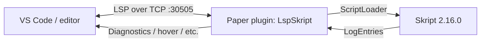

# LspSkript

Full language support for [Skript](https://github.com/SkriptLang/Skript), powered by
Skript's **real parser** running inside your Minecraft server.

Instead of reimplementing Skript syntax in a standalone linter, LspSkript boots an
LSP4J language server **inside a Paper plugin**. It feeds the editor buffer to
Skript's own `ScriptLoader` and maps the resulting log entries into LSP
diagnostics, so the errors you see in your editor are byte-for-byte identical to
what a real `/skript reload` prints in-game.



## Repository layout

This is a multi-module repository:

| Path | What it is |
| ---- | ---------- |
| `skript-lsp/` | **The language server** — a Kotlin Paper plugin (`me.rohandacoder.lspskript`) that runs the LSP4J server over a TCP socket. This is the core of the project. |
| `vscode-skript/` | The VS Code extension client. Talks to the plugin over TCP and renders diagnostics, completions, etc. |
| `skript-grammar/` | TextMate grammar / syntax highlighting schemas shared with other editor plugins. |
| `docs/` | Plans, architecture notes, and other documentation. |

## Features

- Diagnostics (errors/warnings) identical to a real `/skript reload`
- Completion (effects, conditions, expressions, structures, variables)
- Hover documentation
- Signature help
- Go to definition / find references (functions, commands, variables)
- Document outline (sections, commands, functions, events)
- Formatting (re-serializes Skript's parsed config)
- Rename & quick-fix code actions

## How it works

1. The editor sends the current buffer over LSP to the `skript-lsp` plugin.
2. The plugin writes the buffer to a temporary `.sk` file (outside Skript's
   `scripts/` folder) and runs Skript's real `ScriptLoader` on the server main
   thread, capturing output with a `RetainingLogHandler`.
3. The resulting `LogEntry`s are unmapped into LSP diagnostics and Skript syntax
   metadata (effects, conditions, expressions, …) is queried from the live
   `SyntaxRegistry` for completion, hover, and signature help.
4. The temporary script is unloaded so it never lingers on the server.

## Requirements

- A **PaperMC** server with:
  - [Skript](https://github.com/SkriptLang/Skript) `2.16.0` (hard dependency, loaded before the plugin)
  - The **LspSkript** plugin jar installed in `plugins/`
- The plugin listens on a TCP port (default `30505`).

## Building the language server

Requires **JDK 25** (the Kotlin JVM toolchain is pinned to 25) and an internet
connection to resolve dependencies from Maven Central, the SkriptLang repo, and
PaperMC's repo.

```sh
./gradlew :skript-lsp:build
```

The runnable plugin jar (`LspSkript-<version>.jar`, with LSP4J shaded in) is
produced at `skript-lsp/build/libs/`.

> Windows users: use `gradlew.bat` instead of `./gradlew`.

## Releasing

Releases are driven by the [`io.github.rohandacoder.gradle-release`](https://github.com/RohanDaCoder/gradle-release-plugin)
Gradle plugin, configured in the `release { }` block of `skript-lsp/build.gradle.kts`.
It bumps the version in `gradle.properties`, builds the shadow jar, commits +
tags + pushes, and creates a GitHub release with the jar attached via the `gh` CLI.

The plugin resolves from `mavenLocal()` first (see `settings.gradle`), then from
GitHub Packages. To use a locally built copy:

```sh
cd ../gradle-release-plugin && ./gradlew publishToMavenLocal
```

Make sure you are authenticated (`gh auth login`) and on a clean `main`.

```sh
# Patch bump (default) + build + commit + tag + push + GitHub release
./gradlew :skript-lsp:release

# Minor / major bump
./gradlew :skript-lsp:release -Ppart=minor
./gradlew :skript-lsp:release -Ppart=major

# Explicit version
./gradlew :skript-lsp:release "-PreleaseVersion=1.2.3"

# Preview only — computes the version and prints the notes, no commit/tag/push/gh
./gradlew :skript-lsp:release -PdryRun

# Just write the next version into gradle.properties (no build/tag/gh)
./gradlew :skript-lsp:bumpVersion -Ppart=minor

# Just see what the next version would be
./gradlew :skript-lsp:printNextVersion -Ppart=minor

# Preview the notes for a specific tag (defaults: next version, latest tag)
./gradlew :skript-lsp:printReleaseNotes "-Ptag=v0.1.5" "-PprevTag=v0.1.4"
```

> **PowerShell:** quote `-P` arguments (`"-PreleaseVersion=1.2.3"`), otherwise
> PowerShell splits on `=` and Gradle receives a bogus task name.

The version lives in `skriptLspVersion` in the root `gradle.properties`; tags
and GitHub releases are published as `v<version>`. Requires the `gh` CLI to be
authenticated (`gh auth login`).

## Setup

1. Build `skript-lsp` (above) and drop `LspSkript-0.1.0.jar` into your server's
   `plugins/` folder, then start the server.
2. In VS Code, install the `lspskript` extension from `vscode-skript/`.
3. Open a `.sk` file. The extension connects to `localhost:30505` automatically.
   If your server runs elsewhere or uses a different port, set `skriptLsp.host`
   and `skriptLsp.port` in your VS Code settings.

## Configuration

The plugin reads `plugins/LspSkript/config.yml`:

| Key | Default | Description |
| --- | ------- | ----------- |
| `port` | `30505` | TCP port the LSP server listens on. |
| `trace` | `false` | LSP message tracing (`true` for verbose logging). |

## Tech stack

- Kotlin 2.3.0 (JVM toolchain 25)
- [LSP4J](https://github.com/eclipse-lsp4j/lsp4j) 0.23.1
- Paper API `1.21.11-R0.1-SNAPSHOT` (compile-only)
- Skript `2.16.0` (compile-only, provided at runtime)

## Known limitations

- **Parse side effects** — each keystroke feeds the current buffer through
  Skript's real `ScriptLoader`, which has no "don't execute" flag. A temporary
  script that reaches the `on load` event will run its effects on the server.
  Keep `on load` bodies side-effect free while editing, and rely on `/skript
  reload` for anything destructive.
- **Line-level diagnostics** — Skript reports errors per node, but its column
  mapping does not line up with raw editor buffer columns (Skript normalizes
  tabs/whitespace during parsing), so diagnostics span whole lines. This is
  correct by construction, not a bug.
- **Single parse per change** — one `didChange` triggers one parse; very large
  scripts can take a moment before diagnostics refresh.
- **Feature heuristics** — completion context, hover, and references are
  registry/regex driven on top of Skript's parser output, not pure AST queries;
  exotic syntax may be missed.
- **Localhost TCP** — the plugin listens on `127.0.0.1` only; the server and
  the editor must run on the same machine (or use a tunnel).

## License

MIT
